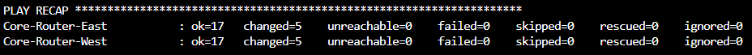
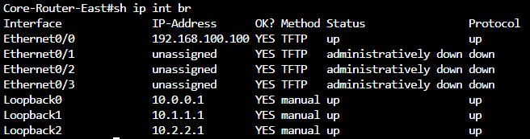
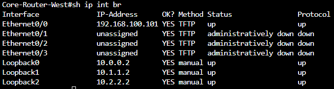
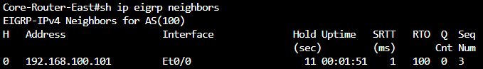
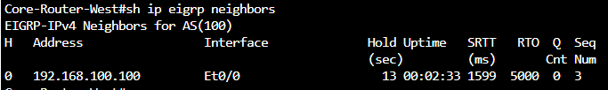

# ansible-assignment-2
Ansible Playbook Assignment 2 for CNIT-381

## Description of Playbook
The following playbook will configure the three loopback interfaces on each router. Next, EIGRP will be configured under Autonomous System 100. All networks, including loopbacks and the management network will be advertised in EIGRP. Lastly, verification will be performed by outputting the EIGRP neighbors and loopback interfaces. 

## Instructions to Run
Run the following command: ```ansible-playbook -i inventory.ini assignment2.yaml```

## Screenshot of Successful Execution
### Successful Playbook Execution


### Output of show ip interface brief
#### Core-Router-East

#### Core-Router-West


### Output of show ip eigrp neighbors
#### Core-Router-East

#### Core-Router-West
